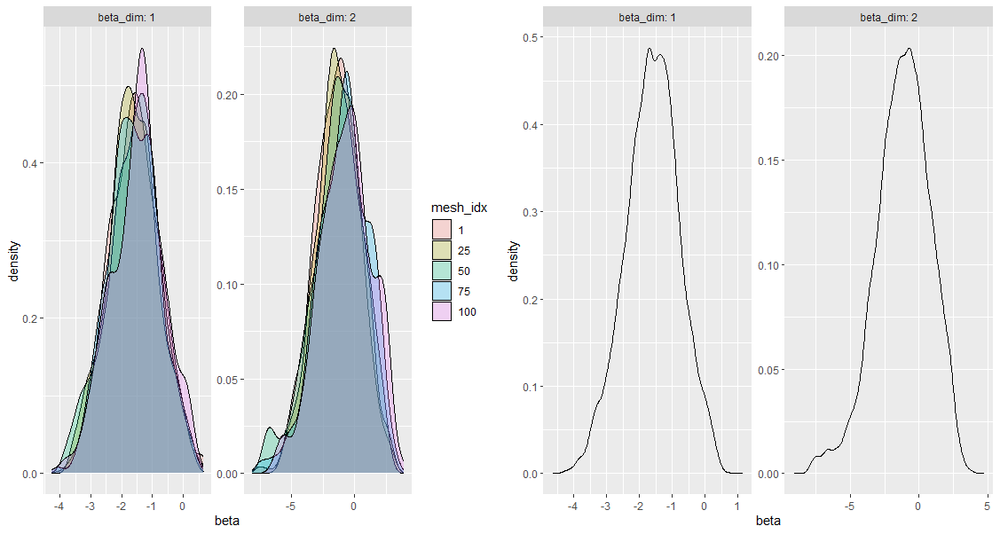

```{r, setup, include=FALSE}
library(formatR)
library(bookdown)
# knitr::opts_chunk$set(
#   results = "hold", tidy=TRUE, tidy.opts=list(width.cutoff=60) 
# )
```

```{r, include=FALSE, message=FALSE, warning=FALSE}
library(tidyverse)
```

\newpage

# Abstract {.unnumbered .unlisted}

The intent of this project is to showcase, implement and empirically analyse the ScaLE algorithm, a continuous time, particle based, Markov Chain Monte Carlo method for sampling and performing interference on complex distributions on large N datasets. The `Scale2` package is introduced and explained providing an implementation for `ScaLE` that is flexible and human-readable providing useful graphical methods for diagnosing convergence.

\newpage

# Acknowledgements {.unnumbered .unlisted}

I would like to thank Prof. Sigurd Assing for his insights and help on this project and providing the inspiration to look more deeply into Monte Carlo methods and particle filters.

\newpage

# Introduction

As the field of Monte Carlo techniques has matured, methods of inference using MC techniques have found increasingly sophisticated ways to sample from complex distributions.

The most popular method of achieving these inferences are Markov Chain Monte Carlo (MCMC) techniques where algorithms try and approximate a target density $\pi(\mathbf{x})$ with a markov chain approaching some form of stationary distribution.

The ScaLE [@pollock-2020] algorithm which is re-implemented in this report uses a variety of classical MCMC techniques use such as control variates, Re-parameterisation & Pre-Conditioning alongside continuous time markov chain methods such as HMC [@HMC] and MALA [@MALA].

The new method ScaLE has interesting properties to create an unbiased estimator of the stationary distribution of a target density using smaller subsets of a theoretically very large $N$ dataset. This gives the ability of the method to scale linearly as the size of the data increases.

The first section of this report gives a mathematical breakdown of the `ScaLE` method. The second gives the core implementation and reasoning behind the `Scale2` package and the third and final section gives an empirical analysis based on some examples.

\newpage

# ScaLE Method

## Set-Up

To demonstrate the method we build up from a simple model to show the challenges and solutions to problems faced in implementing ScaLE. To start, we setup the problem we are trying to solve. We assume a Bayesian model where we want to draw inference from $\mathbf{x} \in \mathbb{R}^d$, given a prior distribution $f_0(\mathbf{x})$ and independent likelihood terms $f_i(\mathbf{x})$ where $i = 1, \dots, N$. Thus our target density we are interested in sampling from is:

$$
\pi(\mathbf{x}) \propto \prod_{i=0}^Nf_i(\mathbf{x})
$$

The aim is either to sample directly from $\pi(\mathbf{x})$ or to draw inferences using a function such as $\mathbf{E}_\pi[g(\mathbf{X})]$. Using a naive technique such as Random Walk Metropolis-Hastings [@Robert2004] a markov chain $X_t$ propagates according to a random walk conditional on a probability dependent on the target distribution.\
Ass $t \rightarrow \infty$, the chain draws should draw samples $X_t \sim \pi(\mathbf{x})$, sacrificing independent samples. With a suitable burn in time and a large enough amount of samples $M$ to reach the stationary distribution, we can estimate an inference function, such as $\mathbf{E}(g(\mathbf{X}))$ as:

$$
\mathbf{E}(g(\mathbf{X})) = \sum_{i=1}^M g(\mathbf{x_i})\pi(\mathbf{x}_i)
$$

A Random-Walk Metropolis Hastings Algorithm can be described as:

1.  Choose $\mathbf{x}_0$, $t=0$
2.  Draw $\mathbf{x}' \sim N(\mathbf{x}_t, \Sigma)) = q(\mathbf{x}_t)$
3.  Accept $\mathbf{x'}$ with probability $min(1, \frac{\pi(x')}{\pi(x)})$
4.  If accepted $\mathbf{x}_{t+1} = \mathbf{x'}$ otherwise $\mathbf{x}_{t+1} = \mathbf{x_t}$
5.  Iterate steps 2 through 4 until the desired number of samples is reached.

The simplicity of this method is useful, but in practice on real data this method can often lead to an inadequate exploration of the target space. The first of these problems is when the markov chain generated is not irreducible with perhaps more than one mode. Even in the case of an reducible the algorithm may not explore and unbiasedly sample from the distribution space in a reasonable time $t$.

Furthermore where the number of likelihood terms of the model is large, computing the probability $\frac{\pi(\mathbf{x}')}{\pi(\mathbf{x})}$ becomes computationally intensive.

## Ellipitical Standardisation

Another problem is how do we choose our starting $x_0$ and $\Sigma$. Given a covariance matrix $\Sigma$ too small the chain will mix slowly and give highly correlated samples needing to draw more samples. Starting the chain at an $x_0$ that is not sufficiently close to the mode of increases the warm-up period before samples from the stationary distribution are drawn.

To address this we transform our target density and perform an "elliptical standardistation" where the distribution is centered at 0 and scaled by the variance. This requires at the start of our algorithm to pre-compute a naive mean $\hat{\mu}$ and scaling matrix $\Lambda^{-1}$. We let the scaling matrix be the inverse fisher information matrix as it is a simple diagonal matrix. Define the invertible transform $S : \mathbf{R}^d \rightarrow \mathbf{R}^d$ as $S(\mathbf{x}) = \Lambda^{-1}(\mathbf{x} - \hat{\mu})$. With $S^{-1}(\mathbf{x}) = \Lambda \mathbf{x} +\hat{\mu}$

In the context of Random Walk Metropolis Hastings we start the chain at $x_0 = 0$ with our random walk proposal distribution $q(x_t)$ simulated as $N(\mathbf{0}, \mathbf{1})$. The update proposal step becomes:

$$
min\{1, \frac{\pi(S^{-1}(x'))}{\pi(S^{-1}(x))}\}
$$ Our final chain is recovered by transforming, $X_t$ by $S^{-1}$. This method is used in this ScaLE implementation to allow differently scaled dimensions to mix well.

## QSMC

Diverging from the discrete model of metropolis Hastings we now consider a continuous time method QSMC where instead of a discrete random walk on a standard normal. We consider a d-dimension Brownian Motion path. For the purposes of explaining and implementing the algorithm we only consider the useful properties for an intuitive understanding. A univariate Brownian Motion Process $W_t \in \mathbf{R}$ has the useful properties that:

1.  $W_0 = 0$
2.  $W_t$ is almost surely continuous
3.  $W_t$ is independent
4.  $\forall \, 0 \le s \le t$, $W_t - W_s \sim N(0, t-s)$

A $d$-dimensional Brownian motion path is intuitively $d$ independent realisations of a univariate Brownian motion path of $\mathbf{R}^D$. To intuitively back up our movement from a random normal walk, sampling a d-dimensional Brownian motion path at $t \in \mathbf{N}$ is equivalent to sampling a random walk where $X_t = N(0, t - (t -1)= N(0, 1))$.

We now introduce the idea of killed Brownian path, a markov chain that is conditioned on a hitting $\eta$, such that the chain stops at time $\eta$. We construct a random variable $\eta$ such that the limiting distribution of the Brownian motion path conditioned on $\eta>t$ as $t \rightarrow \infty$ approximates the target distribution $\pi(\mathbf{x})$. Hence $\forall \, A \in \mathbf{R}^d$: $$
lim_{t \rightarrow \infty} \mathbb{P}(X_t \in A \, | \, \zeta > t) = \pi(A)
$$

This is in contrast to the Metropolis Hastings sampler where the unconditioned chain approximates the target density. In the original paper [@pollock-2020] this approach is referred to as reaching the *Quasi-Stationary Distribution*.

We choose this killing time function $\zeta$ by considering the probability of death of the chain at any given time $t$. We can then characterise $\zeta$ by a hazard function $\kappa(\mathbf{x})$ where at every independent time $t$ the probability of death of the chain at $\mathbf{x}$ will be dependent on $\kappa(\mathbf{x}).$ The relationship between $\zeta$ and $\kappa(\mathbf{x})$ is thus: $$
\zeta := \inf \{ t \ge 0 : \int^t_{0} \kappa(\mathbf{X}_s)ds > U \, \} \quad   U \sim \exp(1) \text{ and } U \perp X_t
$$ Thus at any given time $t$ the distribution $\mu_t$ of the chain of interest is: $$
\mu_t(A) := P(X_t \in A \, | \, t < \zeta)
$$ From the original paper the authors define $\kappa: \mathbf{R}^d \rightarrow \mathbf{R}$ such that $\kappa(x) = \phi(\mathbf{x}) - \Phi \ge 0$ where

$$
\phi(\mathbf{x}) := \frac{||\nabla log(\pi(\mathbf{x}))||^2 + \Delta log(\pi(\mathbf{x}))}{2} = \frac{1}{2}(\sum^d_{i=1} \frac{\partial \, log(\pi(\mathbf{x})) }{\partial x_i}^2 + \sum^d_{i=1} \frac{\partial^2 \, log(\pi(\mathbf{x})) }{\partial^2 x_i}) = \frac{\Delta \pi(\mathbf{x})}{2\pi(\mathbf{x})}
$$ We thus find a lower bound $\Phi$ of $\phi(\mathbf{x})$ where $\kappa(x) \ge 0$. Using this characterisation under **Theorem 1** of the original paper, with some regularity conditions the authors show that $\mu_t$ converges in $L^1$ and pointwise to $\pi(\mathbf{x})$.

### Globally Bounded Sampling

The path of $\mu_t$ evolves according to a time-inhomogeneous poisson process with rate depending on $\phi(X_t)$. For distributions with a globally bounded killing rate, the process can be split into a constant rate poisson process $K$, where $\phi(\mathbf{x}) \ge K$ for all $x$. This constant rate poisson process can be thought of as the total number of events where the process is either killer or not killed. See [@kumar2018] for more details. Hence for events $\xi$ of a poisson process with rate $K$, the probability of the BM chain ending at any event $\xi$ is $\frac{\phi(\mathbf{x}_\xi)}{K}$.

With this framework, we can independently simulate the poisson distribution of rate $K$, then simulate the Brownian motion path. Given poisson process events $\xi_0, \,\xi_1, \dots \xi_k$, the $m$-th sample of the Brownian motion pass can be simulated as:

$$
X_{\xi_{m}} \sim N(X_{\xi_{m-1}}, \xi_{m} - \xi_{m-1}).
$$

To simulate particles from our target density at time $t$, we thus simulate all $k \in \mathbf{N}$ poisson events up until time $t$. Then the Brownian motion path is simulated as shown previously. The probability of the process not being killed and therefore being a sample from $\pi(\mathbf)$ is the probability of the process not dying at each event up to that point. Hence for a weight $W_t$ we have:

$$
W_t := \prod^k_{i=1}(1-\frac{\kappa(\mathbf{x}_{\xi_i})}{K})
$$ We can naively use this as rejection sampling method, however the larger the value $t$, the more poisson updates $k$ and thus the probability of an unkilled chain decreases exponentially as $t$ increases. To counteract this, we use importance sampling and let $W_t$ be the associated weight of the chain at time $t$.

Instead of simulating one chain we simulate $n$ chains, and refer to each individual chain as a particle. As all particles are sampled at the same time $t$ they all have a common constant $\exp(\Phi t)$ for the weights. In practice we use log weights to combat floating point errors. Hence we can renormalise our particles and use standard importance sampling inference tools. Hence:

$$
E_\pi(g(\mathbf{x})) = \frac{\sum^n_{i=1}W_t^{(i)}g( X_t^{(i)})}{\sum^n_{i=1}W_t^{(i)}}
$$

\newpage

### Cauchy Example

For simplicity, say we would like to sample from a Cauchy distribution. Letting us define for a centering value $x_0 \in \mathbf{R}$ and dispersion parameter $\lambda \in \mathbf{R}_+$

$$
\pi(x\, | \, x_0, \lambda) = \frac{1}{\pi \lambda (1 + (\frac{x-x_0}{\lambda})^2)}
$$

To find the function $\phi$ we find the derivative and second derivative of the log likelihood.

$$
\begin{aligned}
log(\pi(x)) &= -log(\pi\gamma) -log(1 + (\frac{x-x_0}{\gamma})^2) \\
\Delta log(\pi(x)) &= -\frac{2(\frac{x-x_0}{\gamma})}{1 + (\frac{x-x_0}{\gamma})^2} \\
\Delta \cdot \Delta log(\pi(x)) &= \frac{4(\frac{x-x_0}{\gamma})^2}{(1 + (\frac{x-x_0}{\gamma})^2)^2} - \frac{1}{1 + (\frac{x-x_0}{\gamma})^2} \\
\phi(x) &= \frac{\nabla log(\pi(x))^2 + \nabla \cdot \nabla log(\pi(x))}{2} \\
&=\frac{4(\frac{x-x_0}{\gamma})^2}{(1 + (\frac{x-x_0}{\gamma})^2)^2} -\frac{1}{1 + (\frac{x-x_0}{\gamma})^2}
\end{aligned}
$$

By taking the derivative of $\phi$ we find exact global maxima and minima of the function. Giving

$$
\begin{aligned}
max_{x} \phi(x\, | \, x_0, \lambda) &= \frac{9}{16} \\
min_{x} \phi(x\, | \, x_0, \lambda) &= -1 &= \Phi
\end{aligned}
$$

Thus let $\kappa(x) = \phi(x) - \Phi$. We can thus implement a simple rejection sampling algorithm with the following `R` code:

\newpage

```{r}
x_0 <- 0; gamma <- 1; c.scale <- function(x) (x - x_0)/ gamma
K <- function(x) (4*c.scale(x)^2)/(1+c.scale(x)^2)^2 - 1/(1 + c.scale(x)^2) + 1
kill.BM <- function(stop.time=5, x0=0, K.upper.bound=(9/16+1)) {
  time <- 0; X <- x0 # Init Time, Brownian Motion State
  killed <- FALSE
  lw <- 0 # Log Weights
  while ((time < stop.time)) {
    # Next Poisson Point event, minimum of t+exp(K) or stop.time
    event <- rexp(1, rate=K.upper.bound)
    time <- min(time + event, stop.time) # update time
    X <- rnorm(1, mean=X, sd=sqrt(event)) # next state of brownian motion
    # If stopping time hasn't been hit then find probability of chain death
    if (time < stop.time) {
      if (killed == FALSE) killed <- runif(1) < (K(X)/K.upper.bound) 
      lw <- lw + log(1 - K(X)/K.upper.bound)
    }
  }
  return(c(time, X, killed, lw))}
```

\newpage

Plotting the killing rate over the global bound shows that for values close to the centering point, the chain almost always survives . Values of $\mathbf{x}$ close to the standard deviations of the Cauchy are more likely to be killed at each poisson event.

```{r killfunc_plot, echo=FALSE, cache=TRUE, fig.cap = "A plot of a Cauchy distribution against the killing rate function", fig.height=2}
set.seed(0)
cauchy.pdf <- function(x) 1/ (pi *(1+x^2))
x_lap <- seq(-10, 10, length.out=1000)

kill_tibble <- tibble(x=x_lap, cauchy=cauchy.pdf(x_lap), killing_rate = K(x_lap)) %>%
  pivot_longer(cols=-c("x"), names_to="functions", values_to="y")

ggplot(kill_tibble, aes(x=x, y=y, color=functions)) + geom_line(linewidth=1.5)
```

The below figure shows two histograms of runs of the rejection sampler both with $100,000$ replications with the difference being the killing time of each algorithm with T=1 and T=5 for left and right respectively both initalised with all points at 1. The $T=1$ run is significantly worse at approximating the target distribution and has a 50% sample acceptance ratio. The $T=5$ while better has only a 1% acceptance ratio giving only 1000, theoretical samples of the original distribution. Using the importance sampler variant with weights $W_t$ gives a distribution that more closely approximates the target density. Due to the initialisation of all particles at $0$, the sampler is unable to approximate the target density at the extremas.

```{r rslb, warning=FALSE, message=FALSE, echo=FALSE, cache=TRUE, fig.height=4.5, fig.cap="(Top) Shows rejection sample runs of QSMC on cauchy data for 100,000 particles for various killing times. (Bottom) Shows importance sampling variant estimated densities of same runs. (Red) Shows target density."}
library(dplyr); library(pbapply)
library(scales)
set.seed(0)
cauchy.pdf <- function(x) 1/ (pi *(1+x^2))
x_lap <- seq(-10, 10, length.out=1000)

kill.BM.info1 <- replicate(n=100000, kill.BM(stop.time=1, x0=0, K.upper.bound=1.5625))
kill.BM.info2 <- replicate(n=100000, kill.BM(stop.time=5, x0=0, K.upper.bound=1.5625))


# proportions(table(kill.BM.info1[3,] == FALSE)) # 52% acceptance ratio
# proportions(table(kill.BM.info2[3,] == FALSE)) # 1% Acceptance

library(matrixStats)

renorm_lw <- function(unorm_log_weight) {
  max_log_weight <- max(unorm_log_weight) # Find the maximum log weight
  log_sum_weight <- max_log_weight + c(logSumExp(unorm_log_weight - max_log_weight)) # Calculate the log of the sum of the exponentiated weights
  norm_log_weight <- c(unorm_log_weight - log_sum_weight)
  norm_weight <- c(exp(norm_log_weight))
  return(norm_weight)
}


par(mfrow = c(2, 2))
hist(kill.BM.info1[2,][kill.BM.info1[3,] == FALSE], breaks=100, probability=TRUE, 
     main="T = 1, acceptance = 50%", xlab='x', xlim=c(-4,4))
lines(x=x_lap, y=cauchy.pdf(x_lap), lwd=5, col = alpha('red', 0.5))
hist(kill.BM.info2[2,][kill.BM.info2[3,] == FALSE], breaks=100, probability=TRUE, 
     main="T = 5, acceptance = 1%", xlab='x', xlim=c(-4, 4))
lines(x=x_lap, y=cauchy.pdf(x_lap), lwd=5, col = alpha('red', 0.5))

nw1 <- renorm_lw(kill.BM.info1[4,])
nw2 <- renorm_lw(kill.BM.info2[4,])

plot(density(x=kill.BM.info1[2,], weights=nw1),
     main="T = 1, IS", xlab='x')
lines(x=x_lap, y=cauchy.pdf(x_lap), lwd=4, col = alpha('red', 0.5))

plot(density(x=kill.BM.info2[2,], weights=nw2),
     main="T = 5, IS", xlab='')
lines(x=x_lap, y=cauchy.pdf(x_lap), lwd=4, col = alpha('red', 0.5))

```

The globally bounded sampling algorithm is limited by definition to distributions with $\phi$ being globally bounded. For multi-modal complex distributions even if such bounds exist they may be hard to evaluate. This algorithm can be further improved by also specifying a lower bound $\phi(\mathbf{x}) \ge K^{\downarrow} > 0$. Which leads to a similar algorithm with again with independence between the Brownian motion path and poisson process of rate $K^\downarrow.$

### Locally Bounded Sampling

To simulate the quasi-limiting process without the restrictions of a global bound on the killing rate function $\kappa(\mathbf{x}).$ The QSMC algorithm, given an initial point $\mathbf{x}_{t}^{(i)}$ defines hypercubes $\mathcal{H}^{(i)}$ of size $2\theta$ centred on $x_0$.

Given that at some hitting time $\tau^{(i)}$ in the future the Brownian Motion path will leave the hypercube, we can find local bounds for $\phi(x)$ for this section of the chain, allowing us to use the same method as the global algorithm on on a bounded $\phi(\mathbf{x})$. We define the hitting time $\tau$ formally for a hypercube as:

$$
\tau := inf\{t\in \mathbf{R : |\mathbf{X}_t - \mathbf{X}_{t^{(i)}}}| > \theta| \}
$$

Hence we bound $\phi(x)$ for the hypercube $\mathcal{H}^{(i)}$, let $L_X^{(i)} \le \phi(x) \le U^{(i)}_X$ for all $X_{t'} \in (\mathbf{x}_{t}^{(i)} - \theta, \, \mathbf{x}_{t}^{(i)} + \theta)$ in the time period $t' \in (t^{i}, \tau^{(i)}).$ The below figure illustrates idea:

```{r, echo=FALSE, message=FALSE, fig.asp = 0.5,fig.cap='Brownian Motion from 0 to 10 showing a boundary parameter of 1. Dotted lines show hitting times Tau'}
BM.path.bounded <- function(x_0=0, from=0, to=10, length.out=10000, theta=0.1) {
  t <- seq(from, to, length.out=length.out)
  diff.sqrt <- sqrt(abs(to-from)/length.out)
  
  path <- numeric(length.out)
  ub <- numeric(length.out)
  lb <- numeric(length.out)
  
  tau <- numeric(0)
  
  path[1] <- x_0
  ub[1] <- x_0 + theta; lb[1] <- x_0 - theta
  
  for (i in 2:length.out) {
    path[i] <- rnorm(1, mean=path[i-1], sd=diff.sqrt)
    
    if ((path[i] > ub[i-1]) | (path[i] < lb[i-1])) {
      ub[i] <- path[i-1] + theta
      lb[i] <- path[i-1] - theta
      tau <- c(tau, t[i-1])
    }
    else {
      ub[i] <- ub[i-1]
      lb[i] <- lb[i-1]
    }
    
  }
  
  return(list(df=data.frame(t, path, ub, lb), tau=tau))
}


# BM.path <- BM.path(x_0, from=0, to=10, length.out=1000)


library(ggplot2)

BM.path <- BM.path.bounded(x_0=0, from=0, to=10, length.out=10000, theta=1)
BM.df <- BM.path$df
tau <- BM.path$tau
ggplot(BM.df, aes(x=t, y=path, ymin=lb, ymax=ub)) + geom_line() + 
  geom_ribbon(fill='red', alpha=0.3) + 
  geom_vline(xintercept=tau, linetype='dashed', color='red', linewidth=0.5) +
  labs(x='Time t', y='X', title='Brownian Motion Path with Hypercubes')

```

The Poisson process is simulated in the hypercube $\mathcal{H}^{(i)}$ with rate $U^{(i)}_X - L_X^{(i)}$ up to time $\tau$. At each event $\xi$ of the Poisson Process we simulate the Brownian Path $X_\xi$, conditional on the process staying in the region $(\mathbf{x}_{t^{(i)}} - \theta, \, \mathbf{x}_{t^{(i)}} + \theta).$ For the time segment of $t^{(i)}$ up to $\tau$, the importance sampling weight of the process with $k$ events will be:

$$
W^{(i)} := C\prod^k_{i=1}(\frac{U^{(i)}_X - \kappa(\mathbf{x_{\xi_i}})}{U^{(i)}_X - L^{(i)}_X})
$$

When the process reaches $\tau$, if the final killing time $T$ of the process has not been reached, we initialise another hypercube $\mathcal{H}^{(i+1)}$ centred on $X_\tau$ Thus we iterate the process until we have reached our final killing time $T$ with the final weight of the particle being:

$$
W_T = \prod_{\{j \in H^{(j)}\}}W^{(j)}
$$

This method hides two hidden complexities, the first is the process of efficiently simulating the hitting time $\tau$ of the Brownian motion chain on leaving the hypercube. The second is the algorithm for simulating intermediate times of the Brownian motion chain conditional on not leaving the hypercube. Both algorithms, discussed further in [@pollock-2016], rely on rejection sampling techniques and are foundational in finding efficient computation of these Brownian motion chains. The independence of the dimensions of the path similarly allows the algorithm, when sampling intermediate points to sample each dimension of the chain separately.

As the Brownian Motion of the path is independent on $d$-dimensions, there are $d$ hitting times $\tau$ for each univariate path. This means for any hypercube, to find intermediate points of the Brownian motion path, the algorithm first needs to find the dimension of the hitting times $\tau$ where the path first leaves the hypercube, when it reaches the first hitting time the algorithm constructs a new hypercube but only needs to update the chain for dimension that was hit.

A below figure illustrates the problem for a two dimensional Brownian motion chain, dimension `X2` reaches the hypercube boundary for $\theta = 2$ before dimension `X1`. Thus when the first hypercube boundary for `X2` has been reached a new updated hypercube would be created.

```{r, echo=FALSE, warning=FALSE, message=FALSE, class.output="floatright", fig.height=5, fig.cap="A 2D simulation of a BM Path with hypercube centered about 0. (Top) plots the first and second coordinate. (Bottom) Plots each component against time. The colour is the time of the chain.W"}
library(mvtnorm)
library(ggplot2)
BM.path.2d <- function(x_0=0, from=0, to=1, length.out=1000) {
  t <- seq(from, to, length.out=length.out)
  diff.sqrt <- sqrt(abs(to-from)/length.out)
  
  path <- matrix(0, nrow=length.out, ncol=2)
  
  
  
  for (i in 2:length.out) {

    path[i, ] <- mvtnorm::rmvnorm(1, mean = path[i-1, ], sigma=diag(rep(diff.sqrt, 2)))
    
  }
  
  return(path)
}
set.seed(10)
BM.path.2d.info <- BM.path.2d()
df.path <- data.frame(BM.path.2d.info) #, num=1:length(BM.path.2d.info))
colnames(df.path) <- c("X1", "X2")
df.path <- df.path[1:475, ]

ind <- 1:dim(df.path)[1]

x1x2 <- ggplot(df.path, aes(x=X1, y=X2, colour=seq(from=0, to=475/1000, length.out=475))) + geom_path()  + scale_colour_viridis_c() + xlim(-3, 3) + ylim(-3, 3) + geom_rect(aes(xmin=-2, xmax=2, ymin=-2, ymax=2), linetype='dotted', alpha=0, size=1.5, color='red') + labs(colour='Time')

x1 <- ggplot(df.path, aes(x=seq(from=0, to=475/1000, length.out=475), y=X1, colour=ind)) + geom_path() + scale_colour_viridis_c() + geom_hline(yintercept = c(-2, 2), color='red', size=1.5, linetype='dotted') + labs(x='time') + guides(color="none")

x2 <- ggplot(df.path, aes(x=seq(from=0, to=475/1000, length.out=475), y=X2, colour=ind)) + geom_path() + scale_colour_viridis_c() + geom_hline(yintercept = c(-2, 2), color='red', size=1.5, linetype='dotted') + labs(x='time') + guides(color="none")

library(gridExtra)
grid.arrange(x1x2, x1, x2, layout_matrix = rbind(c(1,1),c(2,3)))
```

\newpage

### Particle Resampling and QSMC

As discussed previously both the global and local boundedness methods shown are limited by the weights of the particles tending towards 0 as $t \rightarrow \infty.$ A method to address this is to employ a particle filter based methodology. Similar to methods such as SIR, (Sequential Importance Resampling) [@Chopin2020], an adaptive resampling method is used.

Given a killing time $T$, we discretize the chain into $m$ evenly spaced times, $t_i = \frac{i}{m}T$, for $i \in {1, m}$. At each *mesh time* $t_i$, if the effective sample size of the particles at that time is below a certain threshold, the particles are re sampled according to the distribution of normalised weights $W_{t_i}$ with all newly sampled particles having their weights reset to $\frac{1}{n}$. This can be thought of as *filtering* the distribution of particles to remove particles with low importance in the sampling algorithm [@KUPTAMETEE2022110836]

The effective sample size of the chain at any mesh point is as follows:

$$
ESS_i = \frac{1}{\sum_{j=1}^n W_i^{j}}
$$

![A diagram of the resampling method adapted from \[Kuptametee 2022\]](imp-samp.png)

There are numerous algorithms for re-sampling the particles each with different strengths. The easiest to implement is multinomial sampling where, for each particle $r \in \{1, \dots, n\}$, sample $u_r \sim U[0, 1]$ and assign to the $j$th particle if:

$$
\sum_{i=1}^{j-1}W_t^{(i)} < u_r < \sum_{i=1}^{j}W_t^{(i)}
$$ While this is a completely random resampling scheme it often leads to particle impoverishment as regions of the target density with low probability are not adequately sampled. Quasi-Random methods such as, systematic sampling, increase the variance of the number of samples, by choosing $u_r$, as $u_r \sim U(\frac{r-1}{n}, \frac{r}{n})$ and then choosing $j$ similarly as before.

We record the path and the weights of the sample at each mesh point time, after a suitable burn in period $t^*_0$ for the markov chain to approximate the quasi-limiting distribution, an estimator for $\mathbf{E}_{\pi}[g(X)]$ can be constructed using these mesh points and not just the final killing time $T$. Let $M'$ be the number of mesh points post burn in time, re-indexing from the time after burn in, and $N$ the number of particles at each mesh point.

$$
\mathbf{E}_{\pi}[g(X)] = 1/M'\sum_{j=1}^{M'}\sum_{i=1}^{N}W_{t_j}^{(i)}g(X_{t_j}^{(i)})
$$

## ScaLE

As previously stated, when restricting ourselves Bayesian models where the likelihood terms are independent, such as:

$$
\pi(\mathbf{x}) \propto \prod_{i=0}^Nf_i(\mathbf{x})
$$

The power of the ScaLE method comes from our ability to create an unbiased estimator $\hat{\kappa}(X)$ that does not evaluate the full posterior of the model but only a small batch. On massive data, where $N$ is very large, this ability to sample from the likelihood is a method that can be applied on larger distributed machines. Uses may include, training deep neural networks [@li2015preconditioned] and fast efficient path tracing algorithms.

With an unbiased estimator $\hat{\kappa}(X)$, if we find suitable estimated bounds $\tilde{L_X}, \tilde{U_X}$ where $\tilde{L_X} \le \hat{\phi}(X)\le \tilde{U_X}$, then the same algorithm as discussed in the previous QSMC section can be applied, simply by substituting in these new estimated bounds and killing rate estimators.

Using the principle of control variates, where given some known value, we can create an estimator that has a higher variance but is still unbiased. First we show two results. Let $\mathcal{A}$ be the law of $I \sim \{0, 1, \dots, n\}$.

$$
\begin{aligned}
\mathbf{E}_{\mathcal{A}}[(n+1)[\nabla{}log\pi(f_I(\mathcal{x})-\nabla{}log\pi(f_I(\mathcal{\hat{x}))}]] &= \frac{1}{n+1}\sum^{n+1}_{i=0}(n+1)\nabla{}log\pi(f_I(\mathcal{x})-\nabla{}log\pi(f_I(\mathcal{\hat{x}))} \\
&= \nabla{}log\pi(f(\mathcal{x})) - \nabla{}log\pi(f(\mathcal{\hat{x}})) \\
\mathbf{E}_{\mathcal{A}}[(n+1)[\nabla{}^2log\pi(f_I(\mathcal{x})-\nabla^2{}log\pi(f_I(\mathcal{\hat{x}))}]] &= \frac{1}{n+1}\sum^{n+1}_{i=0}(n+1)\nabla^2{}log\pi(f_I(\mathcal{x})-\nabla^2{}log\pi(f_I(\mathcal{\hat{x}))} \\
&= \nabla{}^2log\pi(f(\mathcal{x})) - \nabla{}^2log\pi(f(\mathcal{\hat{x}})) 
\end{aligned}
$$

Where we define the right hand side of the top equation to be $\alpha(\mathbf{x})$ and similarly the left hand side of the expectation be $\hat{\alpha}(\mathbf{x})$.

We show that $\phi(x)$ can be constructed from $\alpha(\mathbf{x})$.

$$
\begin{aligned}
\frac{1}{2}(\alpha(\mathbf{x})^T(2\nabla{}log\pi(f(\mathcal{\hat{x}))} + \alpha(\mathbf{x}))) + \frac{1}{2}\mathbf{1}^T\nabla \alpha{(\mathbf{x})} + [\frac{1}{2}\nabla{}log\pi(f(\mathcal{\hat{x}))}^T\nabla{}log\pi(f(\mathcal{\hat{x}))} + \frac{1}{2}\mathbf{1}^T\nabla{}^2log\pi(f(\mathcal{\hat{x}))}] &=  \\
\frac{1}{2}[\nabla{}log\pi(f(\mathcal{x})) - \nabla{}log\pi(f(\mathcal{\hat{x}}))]^T[\nabla{}log\pi(f(\mathcal{x})) + \nabla{}log\pi(f(\mathcal{\hat{x}}))] + \frac{1}{2} \mathbf{1}^T\nabla{}^2log\pi(f(\mathcal{x))} - \frac{1}{2} \mathbf{1}^T\nabla{}^2log\pi(f(\mathcal{\hat{x}))} \, &+ \\ [\frac{1}{2}\nabla{}log\pi(f(\mathcal{\hat{x}))}^T\nabla{}log\pi(f(\mathcal{\hat{x}))} + \frac{1}{2}\mathbf{1}^T\nabla{}^2log\pi(f(\mathcal{\hat{x}))}] &= \\
\frac{1}{2}\nabla{}log\pi(f(\mathcal{x}))^T\nabla{}log\pi(f(\mathcal{x})) - \frac{1}{2}\nabla{}log\pi(f(\mathcal{\hat{x}}))^T\nabla{}log\pi(f(\mathcal{\hat{x}}))  + \frac{1}{2} \mathbf{1}^T\nabla{}^2log\pi(f(\mathcal{x))} - \frac{1}{2} \mathbf{1}^T\nabla{}^2log\pi(f(\mathcal{\hat{x}))} \, &+ \\ [\frac{1}{2}\nabla{}log\pi(f(\mathcal{\hat{x}))}^T\nabla{}log\pi(f(\mathcal{\hat{x}))} + \frac{1}{2}\mathbf{1}^T\nabla{}^2log\pi(f(\mathcal{\hat{x}))}] &= \\
\frac{1}{2}\nabla{}log\pi(f(\mathcal{x}))^T\nabla{}log\pi(f(\mathcal{x})) + \frac{1}{2} \mathbf{1}^T\nabla{}^2log\pi(f(\mathcal{x))} &= \\
&= \phi(\mathbf{x})
\end{aligned}
$$

This construction allows us to precalculate any centering control variate variables at the start of any run, speeding up computation. This estimator of $\phi(x)$ uses only two datums of our dataset. We define precalculated constant term $C$ where:

$$
C := \frac{1}{2}\nabla{}log\pi(f(\mathcal{\hat{x}))}^T\nabla{}log\pi(f(\mathcal{\hat{x}))} + \frac{1}{2}\mathbf{1}^T\nabla{}^2log\pi(f(\mathcal{\hat{x}))} 
$$

Hence defining $\mathcal{A}$ as the law of $I, J \sim \{0, \dots, n\}$ where $I$, $J$ are independent. The estimator $\phi_{\mathcal{A}}(x)$ given in the expectation below is unbiased using the two above results:

$$
\mathbf{E}_{\mathcal{A}}[\frac{1}{2}(\tilde{\alpha}_I(\mathbf{x})^T(2\nabla{}log\pi(f(\mathcal{\hat{x}))} + \tilde{\alpha}_J(\mathbf{x}))) + \frac{1}{2}\mathbf{1}^T\nabla \tilde{\alpha}_I{(\mathbf{x})} + C] = \phi(\mathbf{x})
$$

## GLM Definition and Derivation

Using [@Dunn_Smyth_2018] as a framework we show how a whole family of GLM models can be implemented.

We model the response variables $y$ as *exponential dispersion models* with pdf:

$$
\mathcal{P(y| \theta, \phi)} = a(y, \phi)exp\{\frac{y\theta - \kappa(\theta)}{\phi}\}
$$

Where $\theta$ is the canonical parameter, $\phi$ is the dispersion parameter and $\kappa(\theta)$ is the cumulant function, with $a(y, \phi)$ a scaling parameter.

We re-parametrise the model in terms of the mean value, $\mu$ instead of $\theta$.

$$
\begin{aligned}
E(Y) = \mu = \frac{d\kappa(\theta)}{d\theta} &\quad Var(Y) &= \phi \frac{d^2\kappa(\theta)}{d \theta^2} & \\
V(\mu) = \frac{d \mu}{d \theta} &\quad &= \phi V(\mu) &
\end{aligned}
$$

For $d$ covariates of length $n$ where $\mathbf{x}_i^T = (1, x^{(1)}, \dots, x^{(d-1)})$ we define the linear predictor for some unknown parameters $\beta \in R^d$ as:

$$
\eta = \beta^T\mathbf{x}_i
$$

Defining a link function $g(\mu)$ and inverse link function $g^{-1}(\eta)$ we map the mean of the EDM to the linear predictor:

$$
g(\mu_i) = \eta_i = \beta^T\mathbf{x}_i \quad g^{-1}(\eta_i) = \mu_i
$$

The GLM model can be defined for $i = 1, \dots, n$ as the EDM model with responses $y_i \sim EDM(\mu_i, \phi)$ and associated link function $g(\mu_i) = \beta^T\mathbf{x}_i.$

As we are interested in sampling from $\beta$ we find the derivative of log likelihood with respect to $\beta$. We first take the derivative of $\theta$ and substitute for $\mu.$

$$
\begin{aligned}
\frac{\partial log P(y | \mu, \frac{\phi}{w})}{\partial \theta} &= \frac{w(y - \frac{d\kappa(\theta)}{d\theta})}{\phi} \\
\frac{\partial log P(y | \mu, \frac{\phi}{w})}{\partial \mu} &= \frac{w(y - \mu)}{\phi V(\mu)} \\
\end{aligned}
$$ Again by substitution, $\frac{\partial \mu}{\partial \beta_{j}} = \frac{\partial \mu}{\partial \eta} = \frac{\partial \eta}{\partial \beta_{j}}$ giving us the final form of the derivative of the log likelihood used for the ScaLE model for the j-th parameter:

$$
\frac{\partial log P(y | \mu, \frac{\phi}{w})}{\partial \beta_j} = \frac{w(y - \mu)x_j}{\phi V(\mu) \frac{\partial \eta}{\partial \mu}} 
$$ Where $\frac{\partial \eta}{\partial \mu}$ is the derivative of the link function and $x_j$ comes from the derivative of the linear predictor.

Instead of computing the total second derivative directly we use the negative fisher information as an approximation. Thus:

$$
\frac{\partial log P(y | \mu, \frac{\phi}{w})}{\partial \beta_j \beta_k} \approx E[\frac{\partial log P(y | \mu, \frac{\phi}{w})}{\partial \beta_j \beta_k}] = -\frac{w}{\phi V(\mu)} \frac{x_i x_j }{(\frac{\partial \eta}{\partial \mu})^2}
$$

The dispersion parameter for EDM models that need it can be estimated from the dataset using the pearson estimator, specified in [@Dunn_Smyth_2018].

$$
\bar{\phi} = \frac{1}{n-p}\sum^n_{i=1}\frac{w_i(y_i -\mu_i)^2}{V(\mu_i)}
$$

In the package, a normal model and binomial model have been implemented by specifying the variance function, link function, inverse link function and derivative of link function. The initial mean parameter $\hat{\mu}$ is fit with the `glm` package.

For a normal model the GLM is specified with:

$$
V(\mu) = 1 \quad g(\mu) = \mu \quad g'(\mu)= 1 \quad g^{-1}(\eta) = \eta  
$$

For a binomial model, using the logit link function:

$$
\begin{aligned}
V(\mu) = \mu(1-\mu) \quad g(\mu) &= log(\frac{\mu}{1-\mu}) \\ 
\quad g^{-1}(\eta) = \frac{exp(\eta)}{1+exp(\eta)} \quad& g'(\mu) = \frac{1}{\mu(1-\mu)}
\end{aligned}
$$

\newpage

# Scale2 Package and Implementation

Alongside this report I have developed an `R` package `Scale2` that has helped me understand and reason about the scale method and why it works. The package provides an easy to understand, well commented and well documented (using roxygen2), implementation that is partitioned over multiple files each implementing different parts of the algorithm.

Whilst this implementation is slow as it is written in `R` the modularity allows for different functionality to be improved over time perhaps using `C++` functions and the `rcpp` package. For example a current bottleneck on the speed for a `binomial` model is the computation of the killing rate.

The package comprises three main parts. The `SCALE` function, which implements the algorithm and provides many options for how the sampler runs. The `Data` distribution classes implement the target distribution and killing rate functions and is designed to be expanded and flexible for future work. Also included are a number of plotting functions for diagnosing the chain, these include trace plots, ess plots and kernel density plots over the time of the chain.

The reference package `scale` written for the paper [@pollock-2020] is hard to parse, with much of the code using unnamed matrices.

This new package provides a more general implementation of the ScaLE algorithm allowing a much larger implementation of models to be evaluated, this is due to the `Data` R6 class explained later in the section. The design of the package has been heavily influenced by functional programming methods and modularity preached in **Advanced R** [@Wickham], additionally **R Packages** has been useful for learning how to write packages [@Bryan].

Alongside the package code, contained in the `\R` directory, unit tests have been written using the `testthat` package to ensuring the core functionality of the package remains consistent. For example, to test the normal model target density; the package provides functions that plot the killing rates and bounds, additionally tests for correctness of different functions are implemented on small example datasets. To test `ScaLE` , small runs of the algorithm, test for working scaling methods, sub-sampling, and re-sampling on small data sets with the same random seeds. These tests compare previous runs and expect the same result as a success condition.

## Scale2 Implementation

### Particle Class

The particle object is the foundation of the ScaLE implementation, we create an S3 class that houses all necessary hypercube (or layer information) for the particle. At it's simplest the class is a list which contains the following fields:

-   `d` - The dimension of the BM path.
-   `path_curr` - An $R^d$ vector of the most recent position of the BM path
-   `log_weight` - The currently accrued log weight of the particle.
-   `time_curr` - A positive value of the most recent time of the path#
-   `id` - A positive unique integer for identifying the specific particle upon resampling.
-   `time_next` - Generated from the poisson process and specifying the next event.
-   `time_next_is_tau` - A logical value which if true notifies us that the next event is a hitting time $\tau$ of the particle.

To define the hypercube we also have the following fields:

-   `path_l`, `path_u`- Both $R^d$ vectors specifying the boundaries of the hypercube
-   `time_tau` - An $R^d_{+}$ vector of hitting times for each dimension $\tau$ of when the particle reaches the hypercube boundary.
-   `path_tau` - An $R^d$ vector of where the hitting time is reached on the BM chain for each dimension.
-   `tau_order` - An index of the dimensions sorted in ascending order according to which hitting time is first.
-   `phi_l`, `phi_u` - Specifying the bounds on the function $\phi(\mathbf)$.

On initialisation a hypercube is constructed around the an initial point given by a d-dimensional standard normal distribution.

### Propagation Algorithm

For each particle the propagation from one temporal mesh point to another is handled by the function `propagate_to_time_target().` The algorithm first centres the hypercube calls `get_phi_info()` which creates an estimator of $\phi(\mathbf{x})$ and upper and lower bounds on the killing rate. The algorithm repeats the steps below until the next desired mesh time is achieved.

The next event time of the chain is found using the function `get_next_event()`. There are three scenarios that `get_next_event()` handles. We first simulate a poisson process event, if either a hitting time $\tau$ of the chain, or the next mesh time is before this poisson event, we propagate to the closest event.

```{r, eval=FALSE}
# p is current particle, time_target is the next mesh_time to propagate to
get_next_event <- function(p, time_target) {
  # poisson process update event
  kingman_event <- rexp(1, rate = p$phi_u - p$phi_l) + p$time_curr
  # Next tau hitting time
  next_tau_event <- p$time_tau[p$tau_order[1]]
  # Next event is minimum of all 3 events
  p$time_next <- min(kingman_event, time_target, next_tau_event)
  # If next event is a hitting time, we update the hypercube at next step
  p$time_next_is_tau <- p$time_next == next_tau_event
  p
}
```

The algorithm then updates all dimensions of the Brownian motion path to the next event conditional on the hitting times of the hypercube. The incremental log weight of the chain is also updated. If this new event is a hitting time we again update the hypercube for the dimension of the boundary that was hit. Finally the next event of the particle is simulated.

A simplified version of the R code is shown below of the particle update trajectory.

```{r, eval=FALSE}
  ### p is the particle, data is the distribution information
  while (p$time_next < time_target) {
    # Propogate particle to next event time 
    p$path_curr <- update_trajectory(p)
    # Update incremental Weight
    incr_log_weight <- incr_log_weight - p$phi_l * (p$time_next - p$time_curr)
    p$time_curr <- p$time_next
    # If particle has reached hitting time tau then update hypercube
    if (p$time_next_is_tau) {
      p <- update_hypercube(p)
      # Get initial bounds on phi and phi function
      phi_info <- get_phi_info(data, p$path_l, p$path_u, rescale, subsample)
      phi_pi <- phi_info$phi_estimator_hyp
      p$phi_u <- phi_info$phi_u
      p$phi_l <- phi_info$phi_l
    } else {
      incr_log_weight <- incr_log_weight +
        log(p$phi_u - phi_pi(p$path_curr)) - log(p$phi_u - p$phi_l)
    }
    # Get next event time for particle
    p <- get_next_event(p, time_target)
  }
```

### SCALE Function

The interface for the `SCALE` function is:

```{r eval=FALSE}
SCALE(num_particles, d, theta, num_meshes, kill_time, data, ess_thresh = 0, 
      parallel = FALSE, resample_every = 10, 
      rescale = FALSE, subsample = FALSE, print_updates = FALSE)
```

Where `num_particles` specifies the number of particles, `d` the dimension, `theta` the hypercube boundary, `num_meshes` for the number of mesh times giving the number of iterations of the propopogation algorithm, `kill_time` as the time at which the algorithm ends and `data` as the R6 class specifying the target distribution.

The `SCALE` function first initialises a list of particles and first specifies the initial hypercube. The particles are initialised as a standard $d$-dimensional normal distribution about 0. As the distribution is scaled with the elliptical method this should give a reasonable initial pre-initialisation of the particles.

The function then sequences along a list `mesh_times` until `kill_time` is reached, this is the core iterative loop of the algorithm. At each step, the algorithm first propagates all particles to the current mesh time and calls `propogate_to_time_target()` for each particle. This returns a list of propogated particle objects and the incremental log weights at each step.

We next call `resample_particles` which checks if re sampling is needed according to whether the ESS is less than the ESS threshold.

We then record at each iteration the state of each particle, the normalised weights of the new particles and extra useful variables such as `ess`, `resample` a boolean of whether the particles were re-sampled. The output to the scale function is finally a list of each mesh iterations particles, and a record of input parameters.

### Resampling Particles

On the `resample_particles` function being called the function first calculated the normalised weights of the particles at the new mesh time and their effective sample size. To efficiently and more accurately normalise the weights we use the log-sum-exp formula:

```{r eval=FALSE}
# Get previous log weights for each particle
prev_log_weight <- map_dbl(particles, "log_weight")
# Get unormalised weights from previous weight and recent propogation
unorm_log_weight <- prev_log_weight + incr_log_weight
max_log_weight <- max(unorm_log_weight) # Find the maximum log weight
# Calculate the log of the sum of the exponentiated weights
log_sum_weight <- max_log_weight + c(logSumExp(unorm_log_weight - max_log_weight)) 
norm_log_weight <- c(unorm_log_weight - log_sum_weight)
norm_weight <- c(exp(norm_log_weight))

ess <- 1 / (num_particles * sum(norm_weight ^ 2))
```

If `ess` is less than `ess_threshold` we re-sample the particles using the chosen sampling method of either Multinomial, Systematic or Stratified.\

## `Data` R6 Class

To handle the calculation of the killing rate function $\phi(\mathbf{x})$ and it's bounds, a hierarchical class based methodology was implemented. This was due to the complexity of the algorithm and wanting the flexibility to implement many different models while reusing as much code as possible. This idea is also used in similarly in the `glm` package where different S3 classes implement different distribution families with shared functionality [@RDocumentationFamily].

The package uses the new `R6` classes that have been developed, these classes are mutable and hence support reference semantics so any changes to their values update across all instances of the class. This new type of class was chosen due to the need to access precomputed variables often. The *Advanced R* book was instrumental in much of the advanced methods used for creating this package[@Wickham].

The parent `Data` class houses the key methods for computing $\phi(\mathbf{x})$ and the bounds, these functions are implemented abstractly in terms of log likelihood functions. Thus child classes only need to implement functions `grad_ll` and `lap_ll` for the gradient and second gradient of the log likelihood respectively for an individual datum.

For an example the `Scale2::Data$phi()` method is implemented as:

```{r}
phi = function(x) { # Phi killing rate function over full posterior distribution
  ## ||grad(log(pi(x))) || ^ 2 equiv to sum of squared first derivatives of log(pi(x))
  grad_ll <- self$total_grad_ll(x)
  sqrd_norm_grad_ll <- sum(grad_ll^2)
  ## calculate laplacian equiv to sum of second derivatives of log(pi(x))
  sum_lap_ll <- self$total_lap_ll(x) %>% sum()

  0.5 * (sqrd_norm_grad_ll + sum_lap_ll)
}
```

The `self` variable here references fields and methods of the class instance and can call fields and methods from child classes.

To find bounds on the killing function, only the radial bound mentioned in [@pollock-2020] needs to be declared in the child class. This simplifies much of the work needed to implement future models.

# Examples and Package Tutorial

## Cauchy Distribution

To illustrate the algorithm for a simple Cauchy distribution with mean parameter $l=-2$ and scale parameter $\gamma =0.5$ We first create a `CauchyData` object, this creates methods for the killing rate and bounds:

```{r}
cauchy_data <- CauchyData$new(mu = -2, gamma = 0.5)
```

The importance sampling propagation requires parameters for the number of mesh points $m$ and the time where the chain finishes $T$. This can be re-parametrised by considering the time difference between each mesh point. If the time between the mesh points of the particles is too long, the weights of the particles degenerate to 0 and thus cannot be renormalised and re sampled with enough accuracy. Too short and the process evolves too slowly for the full distribution to be explored in reasonable time.

As the Cauchy simulation is a univariate distribution we do not sub sample and we use the global bounds found in the [Cauchy Example] section. A difference between mesh times of $1$ over $100$ mesh times, gives a final killing time of $100$. We use $0.5$ as an ess threshold as it generally gives good results.

```{r, eval=FALSE}
set.seed(150)
t_inc <- 0.5 # Time between mesh points
iterations <- 50
kill_time <- iterations * t_inc
num_particles <- 1000
start.time <- Sys.time()
SCALE_info <- SCALE(num_particles = num_particles, d = 1, theta = 5, 
  num_meshes = iterations, kill_time = kill_time, data = cauchy_data,
  ess_thresh = 0.5, resample_every = Inf, 
  rescale = FALSE, subsample = FALSE, print_updates = TRUE)
end.time <- Sys.time()
time.taken <- end.time - start.time
```

The above run takes 3 minutes on an Intel i7-11800H Laptop at 2.3 Ghz with 16GB of RAM.

```{r, include = FALSE, warning = FALSE, message=FALSE, cache=TRUE}
load("CauchyRun.rda")

trace <- trace_path(SCALE_info$debug_hist) + labs(x = "Mesh Index", y = "X") + theme(legend.position="bottom")
estimate <- cauchy_density_estimate(SCALE_info$debug_hist, idx = 10:50, cauchy.x_0 = -2, cauchy.gamma = 0.5) + labs(x="X", y="p(X)") 
path <- cauchy_density_path(SCALE_info$debug_hist, idx = c(1, 10, 20, 30, 40, 50), cauchy.x_0 = -2, cauchy.gamma = 0.5) + labs(x="X", y="p(X)") 
ess <- plot_ess(SCALE_info, show_ess_thresh = TRUE) + labs(x="Mesh Index", y="ESS") + theme(legend.position="bottom")
library(cowplot)
```

Looking at the trace plot and ESS shows that the Brownian motion path is distributed mostly around the centering parameter but takes, 20 to 30 iterations to reach a stationary distribution. The ESS of the chain was very low, this may mean that the mesh time difference was too large. Running again with a mesh time difference of $0.1$ exhibits a higher ESS.

```{r, include=FALSE, fig.cap="Plots for Cauchy Scale Run. (Top Left) A trace plot of the BM path at each Mesh Index, (Top Right) The ESS at each mesh index. (Bottom Left) Kernel Densities Estimates of the Chain Over Time. (Bottom Right) Kernel Density Estimate using chain from 10 to 50. True Cauchy density as red dotted line"}
plot_grid(trace, ess)
```

Looking at the total density estimate plot and comparing against the target cauchy distribution shows the kernel approximates the target density well. Plotting the kernel density estimate at different mesh times shows how the chain approximates the distribution over time.

```{r, include=FALSE, fig.cap="(Top) Total Kernel Estimate of ScalE Sampler in black, Target Cauchy Distribution (Dotted Red). (Bottom) Kernel Density Estimes over Mesh Times in colour, black shows target density."}
plot_grid(estimate, path, nrow=2, ncol=1)
```

## Binomial Model

We fit a logistic regression model on a skewed target distribution. This is the first example in the original paper, the data are 10 samples with a dimension of 2 where $\mathbf{y}^T = (1, 1, 0, \dots, 0)$ and $\mathbf{x_i}^T = (1, (-1)^i/ i)$. This dataset is included as `small_logistic_example`.

We first initialise `Binomial` an R6 class which handles, $\phi(\mathbf{x})$ and it's associated bounding functions.

```{r, results='hide', message=FALSE}
list2env(small_logistic_example, rlang::current_env())
binomial_data <- Binomial$new(y = y, x = x)
```

This first fits a glm binomial model and provides a centering value for use in subsampling $\phi(\mathbf{x})$.

The `Binomial` class inherits from class `GLM` which when initialised: - Estimates the dispersion parameter of the GLM - Finds a bound on hessian for use in bounding `phi` - Estimates a preconditioning matrix $\Lambda$ for better mixing of the particles, this is set to the square root of the sum of each datum's estimated information matrix.

The class `GLM` inherits from class `Data` which provides functions for full and sub sampling from $\phi$ and when initialized calculates the grad and laplacian and log likelihood of the centering control variate $\hat{\mathbf{x}}$.

We next call the `scale` function, we first set parameters. We initialise a run with `1024` particles on `100` iterations. We also need to establish a stop time of our algorithm, this along side theta, specifies how fast the Brownian motion path explores the space.

A larger kill time means that between each iteration will give a greater variance in weights, greater exploration of the distribution and a lower correlation but at the risk of particle degeneracy where as the weights of the particles approach 0, instability increases and renormalisation becomes harder. The time taken to run the following model was 12 minutes.

```{r, results = 'hide', include=FALSE, cache=TRUE}
t_inc <- 0.01 # Time between mesh points
iterations <- 100
kill_time <- iterations * t_inc
num_particles <- 1000
theta <- sqrt(t_inc)
rescale <- TRUE
subsample <- TRUE
ess_thresh <- 0.7

set.seed(150)
start.time <- Sys.time()
SCALE_info_2 <- SCALE(num_particles = num_particles, d = 2, theta = theta, num_meshes = iterations, kill_time = kill_time, data = binomial_data, ess_thresh = ess_thresh, resample_every = Inf, rescale = rescale, subsample = subsample, print_updates = TRUE)
end.time <- Sys.time()
time.taken <- end.time - start.time
```

Included in the package are a number of different diagnostic plots. Looking at the ESS plot below we see that the ESS of the chain decreases until the ess drops below the threshold and rises again.

```{r, cache=TRUE, fig.cap="ESS Plot of Binomial Example"}
plot_ess(SCALE_info_2, show_ess_thresh = TRUE) + labs(x="Mesh Index")
```

Looking at the trace plot shows good mixing over both parameters and highlights the strength of scaling both parameters.

```{r, cache=TRUE}
GLM_trace_path(SCALE_info_2, unscale = TRUE) + labs(x = "Mesh Time")

```



# Evaluation & Conclusion

A key takeaway on implementing scale has been its complexity, this makes it hard to reason through and understand where the method is going wrong. Whilst exact, the added complexity of simulating future hitting times results in a method with a large memory footprint in comparison to popular current samplers such as **SGLD**[@SGLD] and **NUTS** [@hoffman2011nouturn].

One of the main draws of the particle filter is the ability for the propagation of the particles to be ran concurrently. This is constrained by the re-sampling step where traditional methods of resampling such as multinomial and systemic re-sampling are inherently serial processes[@SMMM]. There has been large amount of work in the *SMC* field to create parallel algorithms, the drawbacks are usually that they increase variance or result in particle impoverishment. [@KUPTAMETEE2022110836].

Furthermore due to the large layer information required for each particle, the speed of a concurrent algorithm will be offset by the data transfer overhead of copying all particle info to a new process. When attempting to concurrently run each particle propagation between mesh points, I found that the parallel implementation was a factor of 10 slower due to the time taken to create each parallel process.

A clear solution would be to create smaller batches of particles that are propagated and re-sampled on parallel processes, after a certain number of iterations, all particles are re-sampled on one process and this repeats. A recent paper describes this sort of method as a *multilevel bootstrap* [@heine2022multilevel].

The sub-sampling method, whilst efficiently able to provide estimates of the killing rate function $\phi(\mathbf{x})$ as the size of the data set increases. The bounds on this killing rate can only be estimated, as the killing rate function is multi-modal traditional convex optimisation methods don't work. If the difference between bounds on the killing rate are large then this gives a large rate for the poisson process simulating events leading to more events to simulate and thus added complexity. Providing general bounds on large classes of functions inevitably results in slow computation times.

The method seems to be heavily parameter dependent, the stability of a run is influenced significantly by the time between mesh points and the size of the hypercube $\theta$. Furthermore these hyper-parameters vary significantly depending on the specific distribution. As the method is computer intensive it may not be feasible to run hyper parameter optimization by simulating for many different values.

In conclusion, whilst ScaLE has promising features in theory, in reality the practical implementation and significant processing and memory overheads leave considerable work for any future fast samplers using this method.

# Bibliography

::: {#refs}
:::

# Appendix

All code is provided in a zipped folder called `Scale2.zip`. This contains the package developed for the project. The project is also a repositiory on my personal [Github](https://github.com/ctrlbadger/Scale2) as the Scale2.

Highlighted below are parts of the `Scale2` folder.

## `\R`

-   `cauchy_plots.r` - Density plot functions for Cauchy Model
-   `GLM_plots.r` - Density plots for GLM models.
-   `scale_plots.r` - Diagnostic plots for Scale such as trace plots and ESS plots
-   `Data.r` - Base `Data` R6 Class and `Cauchy` R6 child Class
-   `GLM_Data.r` - `GLM` class with `Normal` and `Binomail` classes as children.
-   `SCALE.r` - The entry point to the package housing the `SCALE` function and particle classes
-   `resample_particles.r` - Particle re sampling methods
-   `propogate.r` - The importance sampler for propagating a single particle.
-   `original_scale_methods.r` - Contains methods that were implemented in the original reference paper such as the hitting time sampler and intermediate points of the Brownian motion chain.

## `\tests`

The test functions housing tests for the Data classes and scale algorithms.

## `\report`

Contains markdown file used to compile this report.
