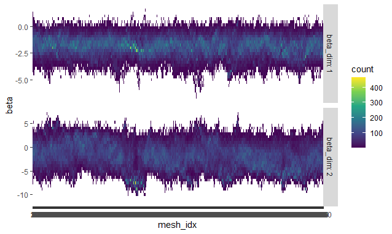

```{r, include = FALSE}
knitr::opts_chunk$set(
  collapse = TRUE,
  comment = "#>",
  eval = FALSE
)
```

```{r setup}
library(Scale2)
```

# Skewed Target Distribution Example

To illustrate how the package works, we fit a logistic regression model on a skewed target distribution. This is the first example in the original paper, the data is are 10 samples with a dimension of 2 where $\mathbf{y}^T = (1, 1, 0, \dots, 0)$ and $\mathbf{x_i}^T = (1, (-1)^i/ i)$. This is generated in code by:

```{r}
set.seed(1)
dsz             <- 10                       # Size of data set
dimen           <- 2                       # Dimensionality (>1)
examp.design <- matrix(c(rep(1,dsz),(-1)^gtools::odd(1:(dsz*(dimen-1)))/c(1:dsz)),nrow=dsz,ncol=2,byrow=FALSE)
examp.data <- c(rep(1,2),rep(0,8))


n <- 10
d <- 2
x <- examp.design 
y <- examp.data
```

We first initialise `Binomial` an R6 class which handles, $\phi(\mathbf{x})$ and it's associated bounding functions.

```{r}
binomial_data <- Binomial$new(y = y, x = x)
```

This first fits a glm binomial model and provides a centering value for use in subsampling $\phi(\mathbf{x})$.

The `Binomial` class inherits from class `GLM` which when initialised:

-   Estimates the dispersion parameter of the GLM
-   Finds a bound on hessian for use in bounding `phi`
-   Estimates a preconditioning matrix $\Lambda$ for better mixing of the particles, this is set to the square root of the sum of each datum's estimated information matrix.

The class `GLM` inherits from class `Data` which provides functions for full and sub sampling from $\phi$ and when initialized calculates the grad and laplacian and log likelihood of the centering control variate $\hat{\mathbf{x}}$.

We next call the `scale` function, we first set parameters. We choose `1024` particles with `1000` iterations. We also need to establish a stop time of our algorithm, this along side theta, specifies how fast the Brownian motion path explores the space.

A larger kill time means that between each iteration will give a greater variance in weights, greater exploration of the distribution and a lower correlation but at the risk of particle degeneracy where as the weights of the particles approach 0, instability increases and renormalisation becomes harder. We choose a stop time of `50`, implying an time increment between iterations of `0.05`.

```{r, eval=FALSE}
num_particles <- 1024
iterations <- 1000
kill_time <- 50
t_inc <- kill_time / iterations
theta <- sqrt(t_inc)
rescale <- TRUE
subsample <- FALSE
ess_thresh <- 0.5

set.seed(150)
filename <- "SCALE_small_logistic_example.rda"
SCALE_info <- SCALE(num_particles = num_particles, d = 2, theta = theta, num_meshes = iterations, kill_time = kill_time, data = binomial_data, ess_thresh = ess_thresh, resample_every = Inf, rescale = rescale, subsample = subsample, print_updates = TRUE)

save(SCALE_info, binomial_data, file = filename)
```

After running the model, we can now analyse our results, a number of different diagnostic plots have been included. Looking at the ESS plot we see that

```{r, cache=TRUE, eval=FALSE}
plot_ess(SCALE_info, show_ess_thresh = TRUE)
```

Looking at the trace plot shows good mixing over both parameters and highlights the strength of scaling both parameters

```{r, eval=FALSE}
GLM_trace_path(SCALE_info, unscale = TRUE)
```



```{r, eval=FALSE}

iterations <- SCALE_info$parameters$num_meshes
idx <- floor(seq(1, iterations, length.out = 10))
density_path(SCALE_info, idx = idx, unscale = TRUE)
idx <- floor(seq(iterations * 0.1, iterations))
density_total(SCALE_info, idx =idx, unscale = TRUE)

idx_sample <- floor(seq(from = length(debug_hist) / 10, to = length(debug_hist)))
```
